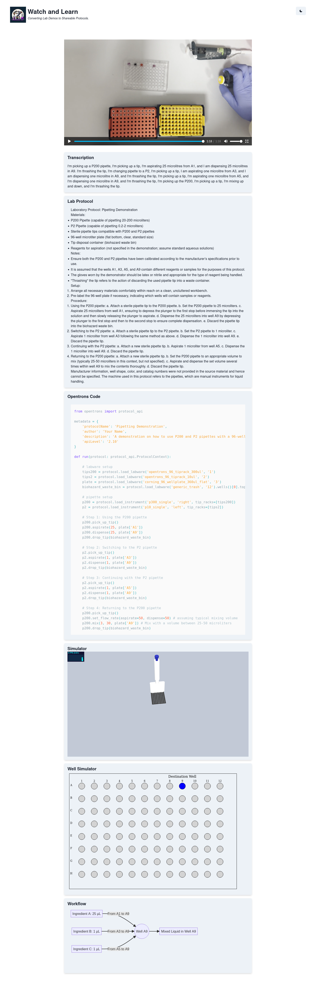

# Watch and Learn

_At the EF Bio X AI Hackathon 2023_

Multimodal AI for lab protocols and automation.

## What we built

We built a web app that allows users to upload a video of a lab protocol and get back a detailed lab protocol using GPT-4V for video processing and whisper for transcription. By sharing reproducible protocols, and automatically generating robotic replication code, we can greatly improve reproducibility, accessibility and scalability of lab demos.

## Tech Stack

- GPT-4V: video understanding and protocol generation
- GPT-4: opentrons code generation
- Whisper: audio transcription
- nextjs and ChakraUI: web app and frontend
- Google Cloud: video storage and cloud functions
- vercel: hosting
- mermaid.js, three.js: robotic visualizations

## Built With

- [Gianluca Truda](https://www.linkedin.com/in/gianluca-truda/)
- [Cathal O'Reilly](https://www.linkedin.com/in/cathalbio/)
- [Jacopo Gabrielli](https://www.linkedin.com/in/jacopo-gabrielli-453b58139/)
- [Daniele Simoneschi](https://www.linkedin.com/in/danielesimoneschi)
- [Lisa Neidhardt](https://www.linkedin.com/in/lisa-neidhardt)
- [Tom Tumiel](https://twitter.com/tomtumiel)

## Demo

For a short demo on the video processing, see `demo.ipynb`

